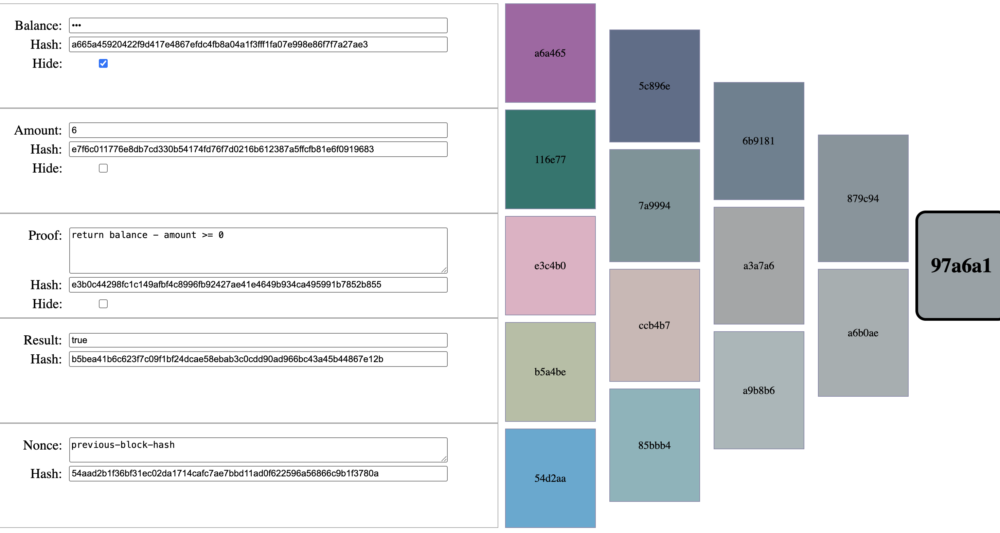

# ZK Proofs

This repo contains some examples used to demonstrate how ZK-proofs work.

There is a live demo which demonstrates inputs with two balances (e.g. before/after balance) which is availalbe at [aaronp.github.io/zk-proofs/](https://aaronp.github.io/zk-proofs/)

# Merkel Tree

There is a basic [merkel-tree](./merkel-tree.html) page:

# Single Balance
And a single-input balance proof [./proof.html](./proof.html):
(e.g. for proving sufficient funds, etc)

